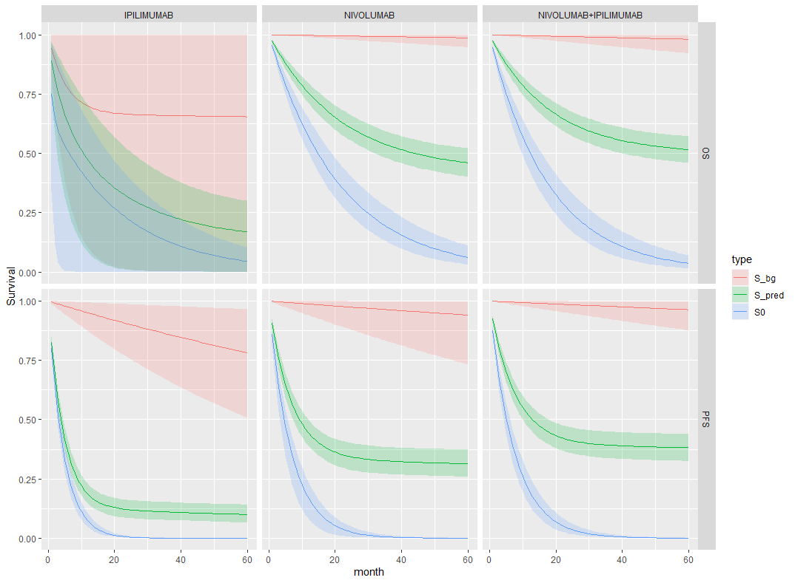

```{r setup, include=FALSE}
knitr::opts_chunk$set(echo = TRUE)
```

[taken from Anthonio]

### Methodology
Immuno-oncologic (IO) studies for melanoma therapies, such as _ipilimumab_, _nivolumab_, and the _nivolumab_
+ _ipilimumab_ combination, have indicated that survival curves “plateau” (a considerable proportion of
patients are “long-term survivors”). Cure models are a special type of survival analysis where this “cure
fraction” (the underlying proportion of responders to treatment/long-term survivors) is accounted for. Cure
models estimate the cure fraction, in addition to a parametric survival function for patients that are not
cured. The mortality risk in the cured patients is informed by a background mortality rate. The population
that is not cured is subject both to background mortality and to additional mortality from their cancer,
estimated using a parametric survival model.

A mixture cure model (MCM) is a type of cure model where survival is modelled as a mixture of two groups
of patients: those who are cured and those who are not (and who therefore remain at risk). The survival for
a population with a cure fraction can be written as follows:

\begin{align}
\tag{*}
S(t, x) = S^*(t, x)[\pi(x) + (1 − \pi(x))S_u(t, x)],
\end{align}

where $S(t, x)$ denotes the survival at time $t$, $S^*(t, x)$ denotes the background mortality at time $t$ conditional on
covariates $x$, $\pi(x)$ denotes the probability of being cured conditional on covariates $x$, and $S_u(t, x)$ denotes
the mortality due to cancer at time t conditional on covariates $x$.
We use World Health Organization (WHO) life tables by country (2018) to inform the background mortality
rate (baseline hazard) inputed to the cure model. Such baseline hazard is the expected mortality rate for
each patient at the age at which he/she experiences the event. The mortality data are age- and gender adjusted,
thus providing a granular account of the different patient profiles in the trial. Note that WHO
reports conditional probabilities of death in 5-year intervals until age 85. A constant annual mortality rate is
reported for individuals over 85. In addition, we make the assumption that the maximum age that a patient
can live up to is 100 years.

To model the disease-specific mortality (the uncured fraction), all standard parametric distributions are tested:

* exponential
* Weibull
* Gompertz
* log-normal
* log-logistic
* generalised gamma.

Parameters for the models, including the cure rate parameter, are derived via Bayesian inference.

### Model description

Let $T_i$ be the non-negative random variable denoting the survival time of patient $i$ with covariate vector $\boldsymbol{x}_i$.

We can assume that the cure fraction is the same for the whole population i.e. $\pi$ is fixed.
Further, we can assume the $\pi$ models the relationship between $\boldsymbol{x}_i$ and the probability of being cured.
E.g. using a logistic-linear model

$$
\pi(\boldsymbol{x}_i | \boldsymbol{\beta}) = 1/[1 + \exp(-\boldsymbol{x}_i^T \boldsymbol{\beta})].
$$

The likelihood of the standard survival is 

$$
L = \prod_i S(t_i | \boldsymbol{x}_i) h(t_i | \boldsymbol{x}_i)^{\delta_i}
$$

Log-likelihood
$$
\mathcal{l} = \sum_i \log(S(t_i | \boldsymbol{x}_i)) + \delta_i \log(h(t_i | \boldsymbol{x}_i))
$$

Plugging this directly into the mixture cure equation in (*) gives

$$
\mathcal{l}(\pi | \boldsymbol{\delta}, \boldsymbol{x}) =
 \sum_i \log(S^*(t_i | \boldsymbol{x}_i) h^*(t_i | \boldsymbol{x}_i)^{\delta_i}[\pi(x) +
   (1 − \pi(x)) S_u(t_i | \boldsymbol{x}_i) h_u(t_i | \boldsymbol{x}_i)^{\delta_i}])
$$

Clearly the cured component is the exponential survival model.
The non-cured component can be thought of in similar terms to the cumulative incidence function.
That is, it is the combined probability of surviving both events (all-cause and cancer mortality) and then experiencing either i.e.

\begin{equation}
\tag{**}
S^* S_u (h^*)^{\delta} + S^* S_u (h_u)^{\delta} = S^* S_u (h^* + h_u)^{\delta}
\end{equation}


Posterior distribution with cure fraction independent on covariates.

$$
p(\pi, \boldsymbol{\beta^u}, \boldsymbol{\beta^*} | \boldsymbol{\delta}, \boldsymbol{x}) \propto L(\pi, \boldsymbol{\beta^u}, \boldsymbol{\beta^*} | \boldsymbol{\delta}, \boldsymbol{x}) f(\pi) g_2(\boldsymbol{\beta^u}) g_3(\boldsymbol{\beta^*})
$$

Cure fraction dependent on covariates.

$$
p(\boldsymbol{\beta^u},\boldsymbol{\beta^*}, \boldsymbol{\beta^{cf}} | \boldsymbol{\delta}, \boldsymbol{x}) \propto L(\boldsymbol{\beta^u},\boldsymbol{\beta^*}, \boldsymbol{\beta^{cf}} | \boldsymbol{\delta}, \boldsymbol{x}) g_1(\boldsymbol{\beta^{cf}})  g_2(\boldsymbol{\beta^u}) g_3(\boldsymbol{\beta^*})
$$

### Exponential

Define $f(t)$ density, $S(t)$ survival and $h(t)$ hazard functions.

$$
f(t) = \lambda \exp(-\lambda t), \;\; S(t) = \exp(-\lambda t), \;\; h(t) = \lambda
$$

Which gives the likelihood

$$
\mathcal{l}(\pi | \boldsymbol{\delta}, \boldsymbol{x}) =
 \sum_i \log(\exp(-\lambda^* t) \lambda^{* \delta_i}[\pi(x) +
   (1 − \pi(x)) \exp(-\lambda_u t) \lambda_u^{\delta_i}])
$$

Substituting $S(t)$ and $h(t)$ into (**)

$$
f^*_u = e^{-\lambda^* t} e^{-\lambda_u t} (\lambda^* + \lambda_u)^{\delta} \;\;\; i.e. \mbox{for no censoring} \;\; T \sim exp(\lambda^* + \lambda_u)
$$


#### Prior specification

The marginal prior distributions will probably depend on which group of data are being modelled.

* _Cure fraction_

We can specify directly using a Beta($a$, $b$) prior, most uninformative at a uniform Beta(1,1).
Incorporating the covariate via a logistic link we specify priors on the linear coefficient $\beta^{cf}_0, \beta^{cf}_1$.
Although not strictly recommended, we could take sensible starting values from the previous frequentist analysis results.
For example, for OS the nivo, ipi and combined mean cure fractions were 45%, 23% and 54%.
If the data are centred then this corresponds to $\beta^{cf}_0 = -0.2, -1.2, 0.16$, respectively.
We would still need to specify how much we expect one year increase in age would change the cure fraction.

* _Background survival_

The default survival curves used in this analysis are from country-level WHO data. We can consider these to provide sufficiently accurate estimates given the sample size and so incorporating uncertainty is not necessary. In fact these annual point estimates are used directly in the frequentist analysis.
This is done by age matching each individual with the life table and then obtaining the mortality rate at the event time.

However, we also want the developed model to be able to be applied to other datasets which may be smaller or noisy.
Sensible prior parameter values can be taken for the life table hazard curve. After infancy the log-hazard is approximately linear and so intercept and slope estimates are simple to obtain.

* _Mortality due to cancer_


### Weibull

$$
f(t) = \frac{k}{\lambda} \left(\frac{t}{\lambda}\right)^{k-1} e^{-(t/\lambda)^k}, \;\;
S(t) = e^{-(t/\lambda)^k}, \;\;
h(t) = \frac{k}{\lambda} \left(\frac{t}{\lambda}\right)^{k-1}
$$

Substituting $S(t)$ and $h(t)$ into (**)

$$
e^{-(t/\lambda_u)^k - \lambda^* t} \left(\lambda^* + \frac{k}{\lambda_u} \left(\frac{t}{\lambda_u}\right)^{k-1} \right)^{\delta}
$$


### Initial results

We fit the exponential hazard model to the study data and produced the posterior survival curves below. The corresponding frequentist curves are also shown for comparison. We see that the curve are similar, providing some initial validation.
Note that one the fits has clearly not converged and so the plots is not meaningful. This is an indication that we need to improve how the model is set-up prior to fitting. This could be that the exponential distribution is not appropriate or that better prior specification of the parameters is needed. We ran the stan engine for over 70,000 iterations so a brute force approach of simply increasing the number of iterations may not be appropriate in this case.




{width=50%}


{width=50%}

